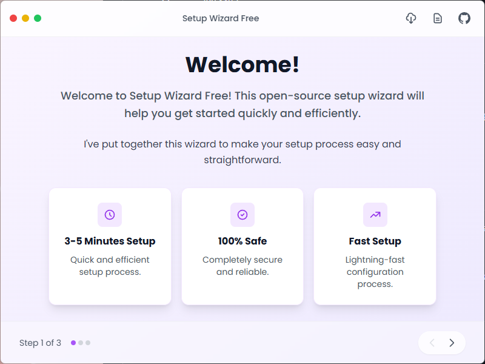
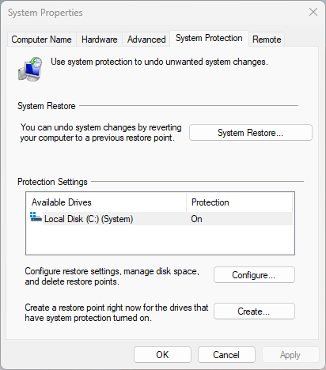
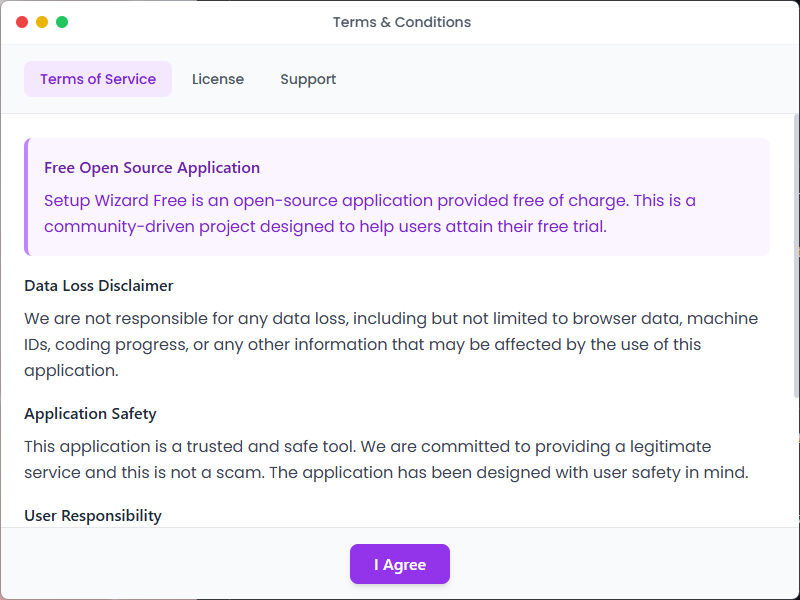

# Setup Wizard Free

<div align="center">


**A free, open-source helper tool for getting your AI free trial**

[](LICENSE)
[](https://www.microsoft.com/windows)
[](https://electronjs.org/)
[](https://reactjs.org/)

[Download](#download) • [Features](#features) • [Installation](#installation) • [Development](#development) • [Contributing](#contributing)

</div>

## 🚀 Features

- **AI Trial Helper**: Step-by-step guide to get your AI free trial
- **Multi-Architecture Support**: Builds for x64, x32 (ia32), and ARM64 Windows devices
- **Modern UI**: Beautiful, responsive interface built with React and Tailwind CSS
- **System Integration**: Direct access to Windows System Restore and System Protection
- **Free & Open Source**: No licensing fees, no obfuscation, completely transparent
- **Easy Installation**: Simple NSIS installer with desktop shortcuts
- **Cross-Platform Ready**: Built with Electron for potential macOS/Linux support

## 📦 Download

### Latest Release

| Architecture | Download | Size |
|-------------|----------|------|
| **x64 (64-bit)** | [Download](releases/latest) | ~150 MB |
| **x32 (32-bit)** | [Download](releases/latest) | ~150 MB |
| **ARM64** | [Download](releases/latest) | ~150 MB |

### System Requirements

- **OS**: Windows 10/11 (x64, x32, or ARM64)
- **RAM**: 4 GB minimum, 8 GB recommended
- **Storage**: 200 MB free space
- **Permissions**: Administrator rights for system restore features

## 🎯 What's New in v1.0.0

- ✨ **Complete Rewrite**: Removed all obfuscation and licensing restrictions
- 🎨 **Modern UI**: Purple-violet gradient design with improved UX
- 🔧 **System Integration**: Direct access to Windows System Protection settings
- 📱 **Responsive Design**: Optimized for different screen sizes
- 🚀 **Performance**: Faster startup and improved memory usage
- 🛡️ **Security**: No authentication required, completely transparent

## 🖼️ Screenshots

<div align="center">


*Welcome Screen with modern gradient design*


*System Restore Integration*


*Terms, License, and Support Information*

</div>

## 🚀 Quick Start

### For Users

1. **Download** the appropriate installer for your system architecture
2. **Run** the installer as Administrator
3. **Follow** the setup wizard to configure your system
4. **Access** system restore features directly from the application

### For Developers

```bash
# Clone the repository
git clone https://github.com/yourusername/setup-wizard-free.git
cd setup-wizard-free

# Install dependencies
npm install

# Start development server
npm run dev

# Build for production
npm run build:installers
```

## 🛠️ Development

### Prerequisites

- **Node.js** 18+ 
- **npm** 9+
- **Git** 2.30+

### Available Scripts

```bash
# Development
npm run dev              # Start Vite dev server
npm run electron-dev     # Start Electron in development
npm run start            # Start with hot reload

# Building
npm run build            # Build for production
npm run build:installers # Build all architectures
npm run build:win-x64    # Build x64 only
npm run build:win-ia32   # Build x32 only
npm run build:win-arm64  # Build ARM64 only

# Utilities
npm run clean            # Clean build directories
npm run format           # Format code with Prettier
```

### Project Structure

```
setup-wizard-free/
├── src/                    # Source code
│   ├── components/         # React components
│   ├── main.js            # Electron main process
│   ├── preload.js         # Electron preload script
│   └── App.jsx            # Main React app
├── assets/                 # Static assets
├── dist-*/                # Build outputs (ignored)
├── electron-builder-*.json # Build configurations
├── build-installers.*     # Build scripts
└── docs/                  # Documentation
```

## 🏗️ Architecture

### Frontend
- **React 18** with modern hooks
- **Tailwind CSS** for styling
- **Vite** for fast development and building
- **Responsive design** with mobile-first approach

### Backend
- **Electron** for desktop application framework
- **Node.js** for system integration
- **PowerShell** for Windows system operations
- **NSIS** for Windows installer creation

### Build System
- **Multi-architecture** builds (x64, x32, ARM64)
- **Separate installers** for each architecture
- **Automated build scripts** for CI/CD
- **Code formatting** with Prettier

## 🤝 Contributing

We welcome contributions! Please see our [Contributing Guidelines](CONTRIBUTING.md) for details.

### How to Contribute

1. **Fork** the repository
2. **Create** a feature branch (`git checkout -b feature/amazing-feature`)
3. **Commit** your changes (`git commit -m 'Add amazing feature'`)
4. **Push** to the branch (`git push origin feature/amazing-feature`)
5. **Open** a Pull Request

### Development Guidelines

- Follow the existing code style
- Add tests for new features
- Update documentation as needed
- Ensure all builds pass before submitting

## 📄 License

This project is licensed under a **Dual License**:

- **Non-Commercial Use**: Free for personal and educational use
- **Commercial Use**: Requires explicit permission from the authors
- **Modifications**: Must be contributed back to the original project

See [LICENSE](LICENSE) for full details.

## 🆘 Support

- **Issues**: [GitHub Issues](https://github.com/yourusername/setup-wizard-free/issues)
- **Discussions**: [GitHub Discussions](https://github.com/yourusername/setup-wizard-free/discussions)
- **Discord**: [Join our Discord](https://discord.gg/your-invite)

## 🗺️ Roadmap

- [ ] **macOS Support**: Native macOS application
- [ ] **Linux Support**: AppImage and Snap packages
- [ ] **Auto-Updates**: Built-in update mechanism
- [ ] **Plugin System**: Extensible architecture
- [ ] **Dark Mode**: System theme integration
- [ ] **Internationalization**: Multi-language support

## 🙏 Acknowledgments

- **Electron** team for the amazing desktop framework
- **React** team for the powerful UI library
- **Tailwind CSS** for the utility-first CSS framework
- **Vite** team for the lightning-fast build tool
- **NSIS** for the Windows installer system

## 📊 Statistics


---

<div align="center">

**Made with ❤️ by the Setup Wizard Free Team**

[Website](https://setupwizardfree.com) • [Documentation](https://docs.setupwizardfree.com) • [Changelog](CHANGELOG.md)

</div>